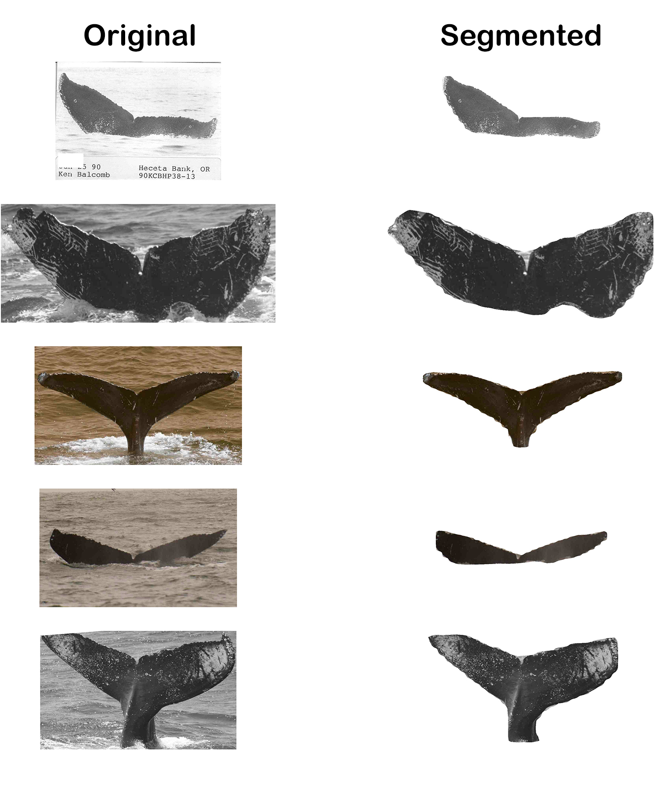

Humpback Whale Segmentation
=======================================================
This repo contains the code required to train a [Detectron2](https://github.com/facebookresearch/detectron2) segmentation model to segment out humpback whale flukes. By only retaining the subject in the image the downstream classification model will avoid overfitting to background elements. The annotations to train the segmentation model were created using [VGG Image Annotator](https://www.robots.ox.ac.uk/~vgg/software/via/). It is a standalone annotation software that runs in a web browser and does not require any installation or setup. The annotations are available in the release section of this repo ([link](https://github.com/seqryan/HumpbackWhaleSegmentation/releases/download/v0.1/detectron2-whale-segmentation-annotations.zip))

#### Training Detectron2
To train the model first download the dataset and the annotation files. Ensure that the respective annotation files are places inside the `dataset/train` and `dataset/test` directories. Run the following command to start training,

```
python run.py train -s [SAVE_WEIGHTS_DIR] -a [ANNOTATIONS_FILE_NAME] -d [DATASET_DIR]
```
At the end of execution the model weights will be saved in `SAVE_WEIGHTS_DIR`

#### Load Pretrained weights and save segmented images
You could either choose to train the model and use the weights from `SAVE_WEIGHTS_DIR` or you could save time and use the pre-trained weights added in the release ([link](https://github.com/seqryan/HumpbackWhaleSegmentation/releases/download/v0.1/detectron2-whale-segmentation-weights.zip)). Either way, to generate segmentation results run the following command,

```
python run.py save -l [SAVE_WEIGHTS_DIR] -a [ANNOTATIONS_FILE_NAME] -d [DATASET_DIR] -o [OUTPUT_DIR]
```

#### Colab Notebook
[Colab notebook available](demo/HumpbackWhaleSegmentation.ipynb) for this project in `demo` folder.

#### Preview of output

